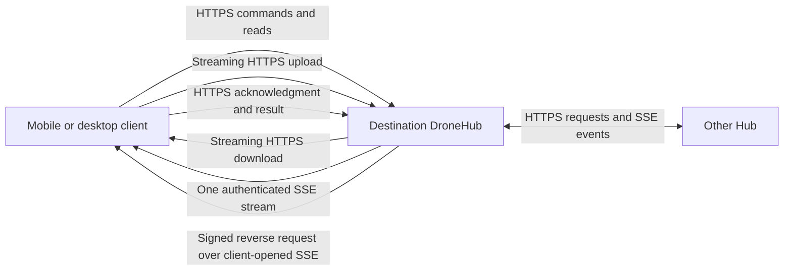

# DroneHub: Tailscale discovery, HTTP transfers, and SSE events

Status: approved; single-cutover code implemented, real-device acceptance pending. See [implementation and validation notes](DRONE_HUB_TAILSCALE_HTTP_SSE_IMPLEMENTATION.md).  
Date: 2026-09-05

This document consolidates the discussion about replacing ngrok as DroneHub's normal connectivity path, automatically discovering Hubs on Tailscale, and moving communication to HTTPS requests and streaming transfers plus Server-Sent Events (SSE). It records the intended behavior, the existing code to change, and the remaining design choices before implementation.

The working assumption is that all participating desktop and mobile devices already run Tailscale and have the necessary tailnet connectivity permissions. Installation alone does not connect unrelated tailnets: devices must share a tailnet or have appropriate sharing and access rules.

## 1. Agreed direction

- Switch the device network to Tailscale, HTTPS, and SSE in one coordinated implementation and release. Remove the old device-network transports in that implementation; there is no gradual rollout or runtime legacy fallback.
- On desktop, enumerate Tailscale peers, probe a predefined DroneHub port, and offer pairing with discovered Hubs.
- Use explicit approval to pair a discovered device. QR codes, deep links, and manual endpoints remain bootstrap and recovery fallbacks.
- Keep DroneHub device identities, signed membership and route information, revocation, destination-owned grants, and audit records.
- Use HTTPS for commands, reads, file uploads, and file downloads.
- Use SSE for small live events, notifications while connected, progress, and incremental chat output.
- Remove the 128 KiB base64 device-network transfer protocol and its client/server fallback paths.
- Replace internal mesh WebSocket RPC, including reverse phone capability requests, with HTTP/SSE equivalents in the same cutover.
- Preserve all existing user data and durable identity/authorization state. Transport replacement must not erase or recreate chats, transcripts, drones, files, attachments, or workspaces.

Tailscale can carry ordinary HTTP and WebSocket traffic between reachable peers. HTTPS remains the application-facing choice for certificate validation, browser compatibility, and the existing endpoint rules. Tailscale replaces the network route; it does not itself replace DroneHub's permission model.

This proposal refines [the existing long-term connectivity architecture](DRONE_HUB_DEVICE_NETWORK_LONG_TERM_ARCHITECTURE.md). Its identity and authorization invariants remain applicable. Earlier multi-provider and relay ideas become optional future work under the all-Tailscale assumption. The [prototype](DRONE_HUB_DEVICE_NETWORK_PROTOTYPE.md), [specification](DRONE_HUB_DEVICE_NETWORK_SPEC.md), and [roadmap](DRONE_HUB_DEVICE_NETWORK_ROADMAP.md) should be reconciled after this proposal is reviewed.

## 2. Current implementation and why changes are needed

| Area | Current evidence | Implication |
| --- | --- | --- |
| Ingress | [device-mesh-ingress.ts](apps/drone/src/hub/device-mesh/device-mesh-ingress.ts) defaults to port 8791, binds to `127.0.0.1`, and exposes a restricted health/pairing/mesh ingress. | A tailnet listener or private forwarding layer is needed before other machines can probe it. |
| ngrok | [device-mesh-ngrok.ts](apps/drone/src/hub/device-mesh/device-mesh-ngrok.ts) and the ingress manager manage tunnel endpoints. | Add Tailscale endpoint management and retire the requirement for an ngrok URL. |
| Pairing | [device-mesh-http.ts](apps/drone/src/hub/device-mesh/device-mesh-http.ts) creates invitation tokens and accepts claims using those tokens. | Automatic discovery needs an additional request-and-approve bootstrap flow. |
| Routes | [device-route-manager.ts](apps/drone/src/hub/device-mesh/device-route-manager.ts) signs, sequences, expires, and validates route announcements. | Extend this existing mechanism; an endpoint change must not create a new identity. |
| Payload limits | [mesh-limits.ts](packages/device-protocol/src/mesh-limits.ts) sets a 256 KiB message ceiling and 128 KiB binary chunks to leave room for base64 and signatures. | These are DroneHub protocol choices, not a universal WebSocket or mobile limit. |
| Large reads | [mesh-content-chunk.ts](apps/drone/src/hub/device-mesh/mesh-content-chunk.ts) and [drone-control-capability.ts](apps/drone/src/hub/device-mesh/drone-control-capability.ts) transfer file previews, directory results, and chat content through snapshot chunks. | Normal reads should have HTTP representations and streaming or pagination where appropriate. |
| Attachment uploads | [upload-mesh-chat-attachment.ts](apps/drone-hub-mobile/src/mesh/upload-mesh-chat-attachment.ts) already tries a binary HTTP PUT, then falls back to base64 mesh chunks. [mesh-chat-attachment-store.ts](apps/drone/src/hub/device-mesh/mesh-chat-attachment-store.ts) streams the HTTP body to disk. | Extend the existing direct-transfer pattern; do not describe every current transfer as WebSocket-only. |
| Desktop HTTP bridge | [desktop-drone-control-http.ts](apps/drone/src/hub/device-mesh/desktop-drone-control-http.ts) accepts local-admin HTTP requests and forwards them through the mesh router. | HTTP at the UI boundary does not yet mean the remote transfer uses HTTP. |
| Desktop SSE | [device-mesh-events.ts](apps/drone-hub/src/droneHub/app/device-mesh-events.ts) already consumes a local Hub event stream with fetch. | Reuse the parser and lifecycle patterns where suitable; add authenticated remote event delivery and replay semantics. |
| Mobile capabilities | [mobile-capability-router.ts](apps/drone-hub-mobile/src/mesh/mobile-capability-router.ts) handles requests targeting the phone. | Removing the phone's WebSocket requires a replacement for inbound logical requests, not just outgoing HTTP calls. |

The current attachment client also constructs its HTTP body from an in-memory byte array. Moving large downloads and uploads to HTTP must include the client file-I/O path; changing the URL alone does not guarantee bounded mobile memory use.

## 3. Intended communication architecture



Cross-device connections in this diagram use Tailscale. A desktop browser may continue using its local Hub as its authenticated bridge; that Hub then uses the new transport to the destination. Mobile should connect directly to the destination when a valid route is available.

| Traffic | Target mechanism | Behavior |
| --- | --- | --- |
| Commands | Authenticated HTTPS POST | Validate destination grants; return a result or job ID. |
| Long-running operations | HTTP job resource plus SSE progress | Retrying a command must not execute it twice. |
| Transcripts and directory listings | HTTPS JSON | Pagination, revision-based reads, and conditional requests. |
| Files and media | Streaming HTTPS GET | Binary response, cancellation, range support when available. |
| Uploads | Streaming HTTPS PUT/POST | Declared size, integrity validation, optional resume. |
| Status, approvals, changes, token deltas | SSE | Small typed events, with recovery after disconnects. |
| Internal mesh RPC | Authenticated HTTPS and SSE | Replace membership, route, capability, and event exchange in the same release. |
| Reverse phone requests | Signed request over client-opened SSE; HTTP acknowledgment/result | Preserve original-source grants, deduplication, expiry, cancellation, and bounded delivery queues. |
| Background mobile alerts | Platform push integration, separately scoped | SSE resumes and reconciles state when the app becomes active. |

The endpoint names below are illustrative contracts to finalize during implementation. They are not claims that these routes already exist.

## 4. Desktop discovery and private ingress

The Hub backend should read `tailscale status --json`, extract visible peers and their addresses, and probe only those candidates. Tailscale documents this output as suitable for automation but warns that its shape may change; isolate parsing behind a tested adapter. The CLI supports desktop platforms and has no iOS or Android support. [Tailscale CLI](https://tailscale.com/docs/reference/tailscale-cli)

Proposed flow:

1. Detect whether the local Tailscale client is available and connected.
2. Read the peer inventory, prioritizing online peers and previously paired devices.
3. Probe a canonical endpoint such as `https://<peer-fqdn>:8791/.well-known/dronehub`.
4. Optionally try one explicitly supported alternate port. Start with bounded concurrency, short timeouts, and a slower retry for initial connection establishment.
5. Validate the descriptor and identity proof, then display compatible Hubs as results arrive.
6. Offer Pair for unknown devices and Connect for known devices. Cache results and refresh on demand or with bounded background polling.

Do not scan the entire Tailscale address range or arbitrary ports. A failed probe means the service could not be reached; it does not prove DroneHub is absent or the device is revoked. Distinguish local Tailscale failure, DNS failure, connection failure, and incompatible protocol when there is enough evidence.

Use port 8791 as the proposed canonical external port. The localhost backend can use a different configured port without changing the advertised endpoint. Prefer Tailscale Serve for private HTTPS forwarding and certificate provisioning. Validate HTTP streaming and SSE flushing through the chosen Serve mode before committing to it. TLS-terminated TCP forwarding is an alternative if HTTP proxy behavior is unsuitable. Preserve unrelated Serve configuration. [Tailscale Serve](https://tailscale.com/docs/reference/tailscale-cli/serve)

Expose only the restricted device ingress. Existing local-admin endpoints must not become remotely accessible simply because they share an `/api/device-mesh` prefix. Tailscale Funnel is public exposure and is not part of this proposal.

The discovery descriptor should contain protocol version, device ID, display name, public key or fingerprint, supported transports, and whether pairing requests are accepted. Keep it free of transcripts, file metadata, grants, and secrets. A signed challenge proves possession of the advertised key; an unknown self-signed key alone does not establish trust. Bind that key to the authenticated endpoint and the subsequent approved pairing.

MagicDNS provides device names; it does not by itself give a mobile app a directory of DroneHub services. [MagicDNS](https://tailscale.com/docs/features/magicdns)

## 5. Pairing and authorization

Discovery and pairing remain separate operations. Discovery locates a service. Pairing enrolls a DroneHub identity and applies the existing explicit membership and permission policy.

For discovered Hubs, add a bounded, expiring pairing-request flow:

1. The initiator sends its public DroneHub identity and a signed challenge-bound request.
2. The destination identifies the tailnet source where possible and displays the requesting machine and DroneHub identity for approval.
3. The user approves or rejects the request on the destination. The initiating UI shows the result.
4. Successful enrollment reuses existing membership rules and explicit grant selection. Tailnet presence alone grants no new DroneHub capabilities.

Tailscale WhoIs can identify the source node and its owner or tags. When Serve proxies the connection, the backend may see localhost: use a verified proxy identity mechanism or supported source-address forwarding before relying on WhoIs. Never trust caller-supplied identity headers. [Tailscale identity](https://tailscale.com/docs/concepts/tailscale-identity)

Keep QR/deep-link invitation tokens for bootstrap and recovery. Keep expiration, replay prevention, rate limits, rejection, and revoked-device checks in both enrollment paths. Do not publish invitation secrets in discovery responses. Automatic enrollment by a specific user or tag is an optional future policy, not the default.

Known devices reconnect using their existing key and validated route announcement. A new Tailscale IP, renamed machine, or restarted tunnel must not reset pairing, revive a revoked identity, or change grants.

## 6. Mobile discovery and lifecycle

A mobile app can use tailnet routes without having a peer-enumeration interface. Android routes apps through Tailscale by default unless excluded. [Android app routing](https://tailscale.com/docs/features/client/android-app-split-tunneling)

No supported cross-app peer-inventory interface was established during this investigation. Treat raw mobile enumeration as an unresolved platform integration, rather than promising it. The recommended initial design is:

- Bootstrap the first Hub through a QR code, deep link, or manually entered MagicDNS endpoint.
- After pairing, obtain authenticated directory information and signed routes for other authorized mesh devices.
- Cache valid candidates and connect directly to each destination over Tailscale. Discovery through one Hub does not make that Hub a required data relay.
- Refresh from any available paired Hub, and retain manual recovery when all cached routes fail.

An account directory or a configured rendezvous service could remove manual first bootstrap, but neither is established as an existing DroneHub capability here. Either would be a separate implementation decision. Do not embed tailnet admin credentials in the phone just to list devices; Tailscale API access tokens require privileged roles. [Tailscale API](https://tailscale.com/docs/reference/tailscale-api)

Phones should normally initiate network connections. Do not depend on an always-listening mobile HTTP server. Implement signed reverse requests over the phone's client-opened SSE stream and post acknowledgments and results back over HTTP. Include expiry, deduplication, cancellation, and original-source authorization. The receiving phone validates the original request and applies its own grants; the delivering Hub does not acquire authority by forwarding it. Transfer large reverse-request inputs and results through authorized HTTP streams, with the phone initiating upload/download as needed. This replacement is required for the single cutover, together with membership, routing, and other internal mesh exchanges.

SSE and WebSockets are both foreground connectivity mechanisms for this design. Reconnect on app resume or network change, refresh credentials, replay available events, and reconcile missing state. Background push support needs its own platform integration and does not guarantee an app can run indefinitely or finish arbitrary work while suspended.

## 7. HTTP capabilities and bulk transfers

Extract destination capability validation and execution from the WebSocket-specific router into the HTTP/SSE implementation, then remove the old device-network transport handlers. Cover existing capabilities, not only drone-control: workspace access and provider credential operations must retain their current restrictions and any application-level encryption requirements.

Use signed requests or sessions established through device-key proof. Sessions must bind to the source and destination identities, expire, and respect revocation and grant changes. Preserve replay protection, audit context, request cancellation, and idempotency for mutations.

A normal file download should be one streaming response:

```http
GET /api/device-mesh/transfers/<id>/content
Authorization: Bearer <scoped-transfer-token>
```

Authorize transfer creation over the control API, then return an authenticated destination endpoint, transfer ID, expiry, resource metadata, and a scoped token. Keep tokens in headers. Bind server-side authorization to the source, destination, resource, and operation; use immutable content versions and hashes where available. A bearer token remains usable by whoever possesses it, even if its record names a source device. If proof of possession is required, bind each request to the device key or an authenticated device session.

Stream bytes from source to socket and from socket to a mobile temporary file with bounded buffers and backpressure. Avoid base64, whole-file JSON, and whole-file JavaScript byte arrays. Validate size and integrity before committing an upload or exposing a completed download. Preserve product size limits unless explicitly changed; removing a transport ceiling does not authorize unlimited attachments.

For downloads, implement byte ranges and `If-Range` with a stable validator where the resource supports them. A changed resource must trigger a clean restart rather than append incompatible bytes. Resume uploads through an explicit offset/session protocol; `Content-Range` on an arbitrary PUT is not a universally supported resumable-upload protocol. Temporary files need expiry, cancellation, and cleanup.

HTTP framing and network packets still divide the stream internally. DroneHub no longer needs repeated 128 KiB JSON messages on this path. WebSockets can carry binary data too; the benefit comes from removing the current envelopes and request loops, using efficient streaming clients, and improving the network path—not from a universal inability of WebSockets to transfer files.

Remove the old chunk protocol, ngrok connection attempts, and device-network WebSocket downgrade logic from the released implementation. An incompatible peer reports that it needs an update; an unreachable route reports a connectivity problem. Neither condition changes stored user data, membership, or grants. QR codes, deep links, and manually entered Tailscale HTTPS endpoints remain discovery/recovery options using the new protocol.

## 8. SSE events and transcript synchronization

Use one authenticated, multiplexed event stream per active destination Hub connection. A desktop UI using its local Hub bridge can continue using that bridge's aggregated stream. Suggested event types include `chat.changed`, `chat.delta`, `file.changed`, `device.changed`, `job.progress`, and `approval.requested`.

SSE is UTF-8 server-to-client messaging with reconnection and event-ID support. The browser EventSource constructor has no arbitrary request-header option. Reuse the existing fetch-based approach for header authentication where supported and validate a compatible native streaming client for mobile. [SSE standard](https://html.spec.whatwg.org/multipage/server-sent-events.html)

Example:

```text
event: chat.changed
id: hub-epoch-7:1842
data: {"chatId":"abc","revision":42}

```

The event cursor belongs to a Hub stream epoch; transcript revision belongs to the chat. They are different identifiers. Define bounded replay retention, duplicate handling, and an explicit reset response when a cursor is expired or belongs to an earlier server epoch. Filter both live and replayed events through current destination permissions.

The client can fetch a delta after an event:

```http
GET /api/device-mesh/chats/abc?afterRevision=38
Authorization: Bearer <device-session>
```

Load recent transcript messages first and paginate older history. Use conditional GETs for unchanged snapshots and compression for sufficiently large JSON responses. Include edits and deletions in revision deltas, coalesce repeated invalidations, and limit concurrent refreshes. Small token deltas may travel directly over SSE; durable transcript reads remain the recovery source.

Prevent gaps between fetching a snapshot and subscribing to events by defining an atomic snapshot cursor or subscribing first and reconciling buffered events against the snapshot revision. Test both server restart and retention exhaustion. A cursor does not itself make event delivery durable.

Flush SSE promptly through every proxy; avoid compression buffering that delays small events. Bound subscriber queues and disconnect slow consumers with recoverable cursors. Use heartbeat comments and reconnect backoff. Verify actual HTTP version and concurrent transfer behavior rather than assuming HTTPS implies HTTP/2.

## 9. Implementation map

These are the main change locations; exact new file names can be chosen during implementation.

| Work | Existing locations | Required change |
| --- | --- | --- |
| Tailscale discovery adapter | New module under `apps/drone/src/hub/device-mesh/` | CLI detection, peer parsing, bounded probes, cached discovery results. |
| Ingress and endpoint lifecycle | `device-mesh-ingress.ts`, `device-mesh-ingress-http.ts`, `device-mesh-ngrok.ts`, `device-route-manager.ts`, `index.ts` | Add Tailscale endpoint source and diagnostics, restricted HTTPS exposure and signed route refresh; remove ngrok management and old transport wiring. |
| Discovery and pairing contracts | `packages/device-protocol/src/types.ts`, `validation.ts`; `device-mesh-http.ts` | Versioned descriptors, challenge-bound pairing requests, approval/status, expiry. |
| Desktop device UI | `DeviceMeshSettingsTab.tsx`, `DeviceMeshIngressPanel.tsx`, `use-device-mesh.ts` under `apps/drone-hub/src/droneHub/app/` | Show discovered Hubs, Pair/Connect actions, Tailscale status, and recovery options. |
| Shared authorization | `device-mesh-router.ts`, `capability-registry.ts`, `device-mesh-request-client.ts`, capability handlers | Transport-independent validation/dispatch, session authentication, idempotency, shared audit and cancellation. |
| HTTP bulk endpoints | `drone-control-capability.ts`, `mesh-content-chunk.ts`, `mesh-chat-attachment-http.ts`, `mesh-chat-attachment-store.ts`, `assistant-filesystem-service.ts`, workspace capability | Direct authorized streams, transfer sessions, resume, integrity and cleanup. |
| Event delivery | `device-mesh-http.ts`, `device-mesh-router.ts`, protocol capability-event definitions | Per-device event authorization, multiplexing, replay/reset, bounded queues. |
| Desktop client | `desktop-drone-control-http.ts`, `device-mesh-events.ts`, `use-remote-drone-hub.ts`, `remote-chat-attachments.ts` | Reuse local bridge while changing its remote transport; add efficient reads and event recovery. |
| Mobile connection layer | `MeshContext.tsx`, `MeshConnectionManager.ts`, `MeshSocket.ts`, `pair-device.ts`, `mesh-storage.ts` | Directory routes, HTTP session lifecycle, SSE client, reverse request delivery/results; remove the device-network socket implementation and fallback negotiation. |
| Mobile data views | `DronesScreen.tsx`, `MobileFileExplorer.tsx`, `use-file-preview.ts`, chunk readers, `upload-mesh-chat-attachment.ts` | HTTP transcript deltas and files, native disk streaming, cancellation, resume, cache validation. |

## 10. Single-cutover implementation and data preservation

Implement and test the complete replacement as one change set, then switch all participating Hubs and mobile clients to the new protocol. Development tasks can be ordered internally, but there are no user-facing migration stages, dual transport modes, or deferred legacy deletions. The completion boundary includes discovery, pairing, HTTP commands and transfers, SSE events, reverse phone requests, membership/route exchange, and removal of obsolete code, settings, tests, and dependencies that are exclusive to the old device-network transport. WebSockets used by unrelated subsystems are outside this removal scope.

Use an explicit new protocol version. Update participating devices together; a device still on the old version remains unavailable for cross-device operations until updated. Its local data remains intact. A missing Tailscale connection must not prevent local access to existing data or trigger empty-state initialization.

Data preservation is a release requirement, not an optional follow-up. Prefer retaining existing storage formats and IDs so replacing communication does not require copying or rebuilding user content. Before implementation, inventory the actual desktop, mobile, host, container, and workspace stores and their relationships. Cover chat messages and transcripts, attachments and artifacts, drone registrations and runtime references, user files, drafts and queued work, settings, device keys, pairing/membership, revocations, destination grants, audit history, and credential references.

Required handling:

- Keep content stores, file locations, object IDs, and ownership relationships unchanged wherever possible. Removing a transfer snapshot implementation must not delete the transcript or file it represents.
- Preserve device keys in place, including non-exportable mobile keys. Carry existing pairings and permissions forward. Rediscovery or a new endpoint requires identity verification, not new enrollment for an already paired device.
- Treat old tunnel endpoints as obsolete route information without deleting the paired device. Recover a Tailscale route through discovery or manual endpoint entry and authenticate it against the existing device key.
- If a persisted schema must change, use a versioned, repeatable migration with transactional or atomic writes. Check disk space and validate records before committing. Never respond to a read/migration error by overwriting a store with empty defaults.
- Before changing persistent state, make an application-consistent recovery copy of affected stores and metadata using each store's supported backup mechanism. Protect those copies as user data. Avoid relying on a raw copy of a live database. Non-exportable keys remain in the platform keystore; the update must not reinstall the app or reset its storage.
- Coordinate the switch with active writes, uploads, and jobs: persist resumable state or safely finish/pause operations, keep already committed data, and retain source files and recoverable partial files. Persist accepted commands and their identities as needed to prevent lost or duplicate work after restart. A reconnect alone must never repeat a destructive operation.
- Separate obsolete transport configuration/cache cleanup from user-content deletion. Remove code in the same change, but only discard stored transient data after establishing that it is disposable and no pending operation depends on it.

Validate the upgrade using populated copies of existing installations, not only fresh installs. Compare stable IDs, record counts and relationships, transcript content, file/attachment hashes where practical, drone runtime references, drafts/queued work, identities, and grants before and after. Verify existing content can be opened through both local access and the new remote protocol. Exercise interrupted migration, low disk space, restart, and a second migration run.

Recovery is an installation/storage operation, not a legacy transport feature in the new product. If upgrade validation fails, retain the affected stores and recovery copies and stop the failed migration without resetting data. Do not restore an older snapshot over newer user writes automatically. Any binary downgrade must first establish storage compatibility and preserve post-upgrade changes; an older backup alone is not a lossless rollback strategy.

## 11. Performance expectations and acceptance checks

The expected improvements come from fewer relays when direct Tailscale connections work, removing base64 overhead and repeated bulk request envelopes, reducing transcript refetches, and avoiding whole-file mobile buffering. Tailscale may still use a peer relay or DERP; direct connections generally offer the best latency and throughput. No speedup factor has been measured for this deployment. [Tailscale connection types](https://tailscale.com/docs/reference/connection-types)

SSE is chosen for the event communication model. Replacing an efficient small-message WebSocket with SSE alone is not expected to materially accelerate downloads.

Record a baseline using the existing build before replacing it, then compare against the complete Tailscale/HTTP/SSE build. Any additional transport experiments belong in test fixtures or isolated builds, not shipped fallback paths. Record direct versus relayed connectivity, file size and content, completion time, time to first byte, request count, wire bytes, peak mobile memory, and event latency during transfers. Measure transcript cold load, unchanged refresh, and incremental update separately. Use realistic permitted sizes; larger test files can use the general file path rather than bypassing attachment product limits.

Before completing the single-cutover implementation, verify:

- Upgrading populated desktop and mobile installations preserves chats, transcripts, drones, files, attachments, drafts, queued work, identities, membership, grants, revocations, and credential references; no reinstall, re-pairing, or content reset is required.
- Persistent-state migration, if needed, survives interruption and reruns without losing or duplicating records. Recovery copies are readable and retained; no rollback silently discards newer writes.
- Two desktop Hubs discover and pair without QR; approval rejection and expiry work.
- Known devices reconnect after sleep, restart, or endpoint changes without new grants or pairing.
- Mobile bootstraps once and subsequently uses directory routes to reach multiple Hubs directly.
- A file downloads to disk without base64 or a full in-memory copy on the normal path; uploads retain declared-size and integrity checks.
- Interrupted downloads resume against the same content version, or restart cleanly when it changes.
- Transcript changes, edits, and deletions arrive without repeatedly downloading all history.
- SSE reconnect handles duplicates, retention gaps, server restart, and the snapshot/subscription race.
- Revoked devices and removed grants are denied on new requests and active event/transfer sessions according to a documented revocation policy.
- Multiple transfers do not make approvals, status, and progress unusably slow.
- Existing phone-local capabilities and other mesh capabilities still work.
- Older-protocol peers show a clear update requirement; no legacy transport is attempted, and data stays available locally.
- ngrok management, device-network WebSocket handlers, base64 chunk transfer paths, associated UI settings, and exclusive dependencies are removed in this change. QR/deep-link recovery uses the new protocol.
- Supported desktop platforms, Android, and any supported iOS build are exercised on real tailnet paths, including a relayed connection and mobile network changes.

Reuse and extend existing device-mesh pairing, capability, transfer, event, and permission tests. Add integration coverage at the HTTP/SSE boundary. Proxy streaming behavior and mobile background/resume behavior need runtime checks, not only unit tests.

## 12. Review choices before implementation

| Choice | Proposed default | What remains to settle |
| --- | --- | --- |
| External endpoint | Private HTTPS on canonical port 8791 via Tailscale Serve | Validate supported desktop packaging, port conflicts, certificate setup, and one alternate port. |
| Initial mobile bootstrap | QR/deep link/manual endpoint, then paired directory | Decide whether zero-manual-bootstrap warrants a separate account or rendezvous service. |
| Pairing policy | Explicit destination approval with existing grant policy | Confirm whether a narrowly scoped automatic-enrollment option is wanted later. |
| Desktop browser access | Existing local Hub bridge | Prefer this unless direct browser-to-peer access has a clear benefit; direct access requires explicit CORS and authentication design. |
| Event transport client | Existing desktop fetch parser plus a verified mobile streaming implementation | Confirm native header authentication, cancellation, resume, and buffering behavior. |
| Cutover policy — decided | One coordinated replacement; remove legacy device-network transports in the same implementation | Define the new protocol version and update-required error; no gradual rollout or legacy fallback. |
| Reverse phone requests — decided | SSE request delivery plus HTTP acknowledgments/results in the same release | Finalize delivery, deduplication, cancellation, expiry, and large-result streaming contracts. |
| Data preservation — required | Retain existing content, IDs, keys, membership, and grants; back up affected state before any necessary schema conversion | Inventory stores and active work, then implement and verify upgrade/recovery handling against populated installations. |
| Background notifications | Foreground SSE and resume reconciliation first | Scope platform push integration separately if background alerts are required in this migration. |
| Performance target | Measure baseline and require demonstrated improvement without correctness regressions | Set numerical targets from representative devices and networks before final rollout. |

This document records the approved direction. Implementation is in progress; the replacement and legacy code removal must be completed together, with data-preservation verification required before the cutover is considered complete. Passing protocol tests alone does not satisfy the real-device, upgrade, and performance acceptance checks above.
