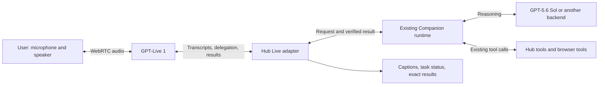

# GPT-Live 1: a practical primer for Companion

Verified against current official OpenAI documentation on **September 11, 2026 (UTC)**. Repository observations describe the code inspected on that date. This primer describes the architecture and tradeoffs researched before implementation. See [Companion Live voice](companion-live-voice.md) for the implemented client-delegation toggle and its current limits. No measured performance is reported here.

## The short answer

**GPT-Live 1** is OpenAI's voice conversation model; its API model ID is **`gpt-live-1`**. It can listen while speaking and keep a conversation going while a separate backend handles reasoning and tools. OpenAI calls simultaneous listening and speaking **full duplex**. Think of Live as the conversational part of Companion, with our existing agent doing the task work. [Official getting-started guide](https://developers.openai.com/api/docs/guides/live)

**Yes, we can connect our own LLMs and existing agent runtime.** OpenAI provides both a managed OpenAI backend option and an application-managed option called **client delegation**. For Companion, I recommend evaluating client delegation with the existing Sol-backed runtime first. That preserves our model selection, tools, context handling, and review flows. [Voice architecture guide](https://developers.openai.com/api/docs/guides/voice-agents)

The likely benefit is a more fluid conversation, including interruptions and follow-up speech during work. A faster correct answer is possible, but needs measurement: Live does not remove the time Sol spends reasoning or waiting for tools.

## Name, release date, and availability

| Question | Verified answer |
| --- | --- |
| Exact display name | **GPT-Live 1**. |
| API model ID | **`gpt-live-1`**. |
| API surface | **Live API**, with session creation at `POST /v1/live/sessions`. |
| Available today? | **Yes.** OpenAI's API changelog says it is generally available. |
| Did it launch today? | The changelog dates general availability to **September 10, 2026**, one day before this document's September 11 verification date. |
| Available to our specific project? | Not tested with our credentials. Published availability does not establish our project's access or quota. |
| What does “GPT Sol” mean here? | **GPT-5.6 Sol**, model ID **`gpt-5.6-sol`**. |

The release date and availability come from the dated [API changelog](https://developers.openai.com/api/docs/changelog). The exact model identifiers come from the [GPT-Live 1 model page](https://developers.openai.com/api/docs/models/gpt-live-1) and [GPT-5.6 Sol model page](https://developers.openai.com/api/docs/models/gpt-5.6-sol).

Do not confuse Live with a transcription model or assume an existing Realtime integration only needs a model-name change. Live has a different session and event contract. [Migration guide](https://developers.openai.com/api/docs/guides/live-migration)

## How the two models work together

There are two distinct responsibilities:

- **Live handles the conversation:** listening, speaking, conversational timing, and deciding when to involve the backend.
- **The backend handles tasks:** reasoning, looking things up, choosing tools, and returning results. Our application still executes private operations and owns permissions and task state.

For example, the user asks Companion to find an earlier discussion. Live can acknowledge the request while the backend searches. The user can add a clue during that search. Once the backend has a result, Live can explain it aloud. This is the documented division of responsibility; it does not establish any particular hidden neural architecture or shared internal model state. [Getting started](https://developers.openai.com/api/docs/guides/live)

### Option A: OpenAI manages the backend calls

With **Responses delegation**, we configure the backend model, instructions, and supported tools. Live manages its calls and context; our application executes custom functions. Only a subset of Responses features is exposed. [Delegation guide](https://developers.openai.com/api/docs/guides/live-delegation)

Conceptually, the session configuration includes:

```json
{
  "model": "gpt-live-1",
  "delegation": {
    "type": "responses",
    "responses": {
      "model": "gpt-5.6-sol",
      "instructions": "Handle Companion tasks using the supplied tools."
    }
  }
}
```

This configuration fragment is illustrative, not a complete connection or an account-tested compatibility result. Sol supports Responses; validate this pairing and its settings when prototyping. [Sol model documentation](https://developers.openai.com/api/docs/models/gpt-5.6-sol)

### Option B: our application runs the backend

With **client delegation**, select `delegation: { "type": "client" }`. Our application runs its chosen model, agent, or service, including other providers or self-hosted models. Live itself stays hosted by OpenAI. [Delegation guide](https://developers.openai.com/api/docs/guides/live-delegation)

For our design, “client” does not mean running Sol in the browser: the Hub would own backend execution.

This is the better initial fit for Companion because the value we want to preserve includes its runtime and tools, not just Sol's text generation. It also means “use any LLM” requires an adapter: Live does not accept an arbitrary model-provider URL and automatically operate our agent.

## What actually crosses the boundary?

In client mode, `session.delegation.created` announces a request for backend help. It supplies metadata and timing, **not a complete prompt, tool arguments, or the original waveform**. Our adapter must assemble the request from accumulated transcripts and application state. A delegation may arrive before the transcript establishes the full request; retain it until there is enough context to act. Raw audio is not automatically passed to the backend. [Migration guide](https://developers.openai.com/api/docs/guides/live-migration)

Useful events are:

| Event | Application use |
| --- | --- |
| `session.input_transcript.delta` | Accumulate the user's recognized speech. |
| `session.output_transcript.delta` | Accumulate Live's spoken wording. |
| `session.delegation.created` | Record `delegation.id` and dispatch an assembled request. |
| `session.commentary.append` | Return a speakable result, correlated with `delegation_id`. |
| `session.thinking.append` | Supply context without requesting immediate speech. |

These are streaming fragments and updates, not a guarantee of perfectly transcribed turns. [Delegation event flow](https://developers.openai.com/api/docs/guides/live-delegation)

Live paraphrases speakable updates; it is not guaranteed to read Sol's text verbatim. Quiet context can influence later speech, so it is not a private channel for secrets. Appends have a 500-token limit. An acknowledgment means context was accepted, not that the user heard it. [Session context and acknowledgments](https://developers.openai.com/api/docs/guides/live-conversations)

For Companion, I would keep three records distinct: what the user said, what the backend actually did, and what Live said. The UI should retain the exact backend result and proposal even if the spoken explanation is shorter or interrupted.

## How this differs from transcription → LLM → speech

| Aspect | Chained voice pipeline | Live with a separate backend |
| --- | --- | --- |
| Components | Speech recognition, text agent, text-to-speech. | Conversational voice model plus delegated backend. |
| Backend choice | Application chooses it. | Application chooses it in client mode; managed mode uses a supported Responses model. |
| Control of wording | Application can inspect the text before sending it to speech generation. | Live chooses conversational wording and can speak independently. |
| Conversation during work | Application must coordinate listening, playback, interruptions, and ongoing work. | Continuous conversation is part of the voice interface. |
| Intermediate text | Explicit stages are easy to inspect or transform. | Transcripts and backend results still matter, especially in client mode. |

These are architectural differences, not benchmark results. A well-built chained system can also stream and support interruption. [Official comparison of voice architectures](https://developers.openai.com/api/docs/guides/voice-agents)

The distinction matters if we want **Sol to approve every spoken sentence**. Live can speak before Sol finishes. Returning only validated backend results does not validate every utterance Live generates. If exact spoken content is a hard requirement, the chained approach gives us a more direct control point; controlling or buffering Live playback adds integration work and latency. [Migration and playback considerations](https://developers.openai.com/api/docs/guides/live-migration)

## Would it be faster?

**My assessment: likely more responsive than Companion's current record-then-transcribe interaction; not guaranteed to produce useful answers faster than an optimized streaming pipeline.** This is an engineering inference, not a measured result.

Separate three timings:

1. **First acknowledgment:** when the user hears that Companion is listening or working.
2. **First useful answer:** when the user hears information that actually answers the question.
3. **Task completion:** when the requested operation has really finished.

An immediate “I'm checking” improves the first metric without necessarily improving the other two.

For a simple sequential implementation, the critical path after speaking is roughly:

```text
Chained:
detect end of speech → finish transcription → agent/tools → start speech output

Live with client delegation:
enough transcript/context → dispatch agent/tools → return useful result → Live speaks
                         ↳ conversation can continue during this work
```

These sketches explain dependencies, not fixed processing stages or promised timing. Streaming speech recognition can process audio while the user talks; streaming text-to-speech can start before the LLM finishes its entire answer. Comparing Live only with a fully buffered pipeline would overstate the benefit.

Managed delegation prepares and reuses Responses connections/state where possible. In client mode, we implement these optimizations. [Backend latency guidance](https://developers.openai.com/api/docs/guides/live-delegation)

For Sol, the practical questions are how soon our adapter can establish the request, whether Companion queues it behind another task, and whether we can return a useful result before the full run completes. Another model invocation merely to rewrite each answer for speech could consume the time we save.

## Where Companion stands today

The inspected code already contains most of the task backend we would want to keep:

| Existing piece | What it does and why it matters |
| --- | --- |
| [CompanionContext.tsx](../../drone-hub/src/droneHub/companion/CompanionContext.tsx) | Captures workspace context, waits for `stopRecordingForTranscript`, then submits text through `/api/companion/stream`. This Companion path still has a transcription-before-submission boundary. |
| [use-chat-voice-recorder.ts](../../drone-hub/src/droneHub/chat/use-chat-voice-recorder.ts) | Records audio and posts WAV data to `/api/audio/transcriptions`. |
| [companion-runtime.ts](../src/hub/companion/companion-runtime.ts) | Configures the Blip agent with the selected provider, model, reasoning, tools, skills, and workspace access. |
| [companion-run-session.ts](../src/hub/companion/companion-run-session.ts) | Correlates requests and browser tool calls by message ID. Follow-up prompts queue while a run is active. |
| [companion-config.ts](../src/hub/companion/companion-config.ts) | Defines tool and runtime rules, including verified mutation results and proposal handling. |
| [llm-model-catalog.ts](../src/hub/llm-model-catalog.ts) | Already lists `gpt-5.6-sol` for OpenAI and Codex. |
| [companion-telemetry.ts](../src/hub/companion/companion-telemetry.ts) | Already records transcription, queue, runtime, and model timing information. |

The repository also has [continuous voice steering](continuous-voice-steering.md) for chat input and an [existing Realtime WebRTC implementation](../../voice-stream-next/server/src/openai-realtime-webrtc.ts) in another app. They are useful references, but neither establishes that Companion already supports Live or that its backend can accept same-turn corrections. In particular, Companion's inspected run session queues new prompts; it does not expose the Codex chat steering behavior described in the continuous-voice document.

## Proposed integration with Sol in the background

This section is a repository-specific design recommendation, not existing behavior.



### Connect the audio session

Use WebRTC for desktop/browser audio. The browser creates a connection offer; an authenticated Hub route sends it to OpenAI with the server-owned session configuration and API key, then returns the answer. Wait for `session.started` before application commands. WebRTC creation starts the session; do not send a second `session.start`. [Live WebRTC setup](https://developers.openai.com/api/docs/guides/voice-webrtc?api=live)

Attach a Hub-side WebSocket to the same session for backend events and commands. OpenAI calls this a **sideband** connection: audio stays on the browser's media connection while the server handles transcripts, delegation, and private tools. Use the returned session ID, not the old Realtime `call_id` contract. [Server-side controls](https://developers.openai.com/api/docs/guides/voice-server-controls?api=live)

### Adapt requests into Companion

Maintain a small mapping between the Live session/delegation, Companion run/message, and current task revision. Build role-labeled context from both sides of the conversation. Avoid submitting every transcript fragment as a new Companion prompt: “yes” and “actually, the other file” need the preceding exchange.

Preserve Companion's captured-target behavior. For an initial prototype, capture the workspace at voice-session start and show its name. If the user changes the intended target, update it explicitly for subsequent tasks. Capturing each utterance's context is another possible design, but would need a defined utterance boundary. Reading whichever editor happens to be focused when a delayed result arrives would break the existing protection against acting on the wrong file.

Keep all real tool execution in Companion. Voice summaries should describe confirmed results. A proposal being prepared should be described as ready for review; it should not be announced as applied. This preserves the distinction already enforced by the current Companion configuration.

### Return results and handle corrections

Initially, return a concise factual summary when the existing runtime produces its reply. Preserve Markdown, exact filenames, and proposal cards in the UI. Later, forward verified intermediate facts when runtime events give us a reliable way to identify them. Do not narrate raw reasoning events.

Keep **stop speaking**, **cancel task**, and **end voice session** as distinct controls. Cutting off audio must not silently cancel useful work. Conversely, a request to cancel a pending edit needs an actual backend cancellation outcome.

Because the current runtime queues follow-ups, a correction may arrive too late to affect an active action. The adapter should invalidate stale results and check task revisions before mutations; true steering needs explicit runtime support. Do not advertise seamless task correction merely because the voice model can listen during work.

### Make the experience understandable

Show connecting, listening, speaking, backend working, reconnecting, and error states. Disable competing microphone capture while this session owns the mic. Empty or unclear speech should not create tasks. Keep captions and typing available if audio fails, and show whether a task continues after the voice connection closes.

Start with a desktop opt-in mode. Mobile needs separate validation of native audio, Bluetooth, speaker echo, backgrounding, and screen-lock behavior; reuse the existing device-mesh/runtime path where it fits, but do not assume browser WebRTC code is a drop-in mobile implementation.

## Prompts, limits, and costs

Use separate prompts. Give Live a short description of Companion, the desired speaking style, and concrete conditions for asking the backend for help. Keep tool procedures and detailed rules in the backend. The prompting guide recommends explicitly describing backchannels—brief listening acknowledgments—and interruption behavior. [Live prompting guide](https://developers.openai.com/api/docs/guides/live-prompting)

For our prototype, the voice policy should favor short replies, delegate app actions and substantive reasoning, and wait for verified results before reporting success. It should describe only capabilities the configured Companion backend actually exposes.

The model page lists text/audio input and output, but no image/video input, fine-tuning, or Structured Outputs for Live itself. It prices voice at **$0.05 per minute, billed per second**, separately from backend usage. Published concurrency limits are 25/50/200/300/500 sessions for tiers 1–5; the free tier is unsupported. [Model capabilities and limits](https://developers.openai.com/api/docs/models/gpt-live-1)

Ten active voice minutes therefore cost **$0.50 plus backend usage**; an hour costs **$3.00 plus backend usage**. These are arithmetic estimates at the verified rate. Silence and backend waiting count as active time. Muting does not stop billing. WebRTC creation bills 15 seconds at initialization, credited against running duration rather than added again. Close unused sessions and collect the final reported usage. [Voice cost accounting](https://developers.openai.com/api/docs/guides/voice-latency-cost?api=live)

Live automatically compacts long conversations. The session guide specifies a default 128,000-token context including audio, with replacement-engine history limited to 8,192 tokens; important details can be summarized away. Keep authoritative task state in Companion. Voice and delegation mode are startup choices. Storage defaults to false; enabling stored recordings requires project support. On shutdown, send `session.close`, wait for `session.closed` and final usage, then clean up transport and audio resources. [Session lifecycle and context](https://developers.openai.com/api/docs/guides/live-conversations)

## What to measure before choosing it

Compare three implementations with the same Sol configuration and tools: today's Companion interaction with spoken output added, an optimized streaming transcription/LLM/speech pipeline, and Live with client delegation.

Use representative tasks: a simple question, finding a chat, editing a composer, preparing a proposal, a slow lookup, a correction during work, and cancelling an action. Measure median and slow-case time to acknowledgment, useful speech, and completed task. Also measure correctness, duplicate actions, missed corrections, transcript errors, interruption response, and total cost per successful task.

Extend Companion's existing timing records with speech-end, delegation, useful-result, and actual playback timestamps. A server event saying audio was generated is not evidence it reached the speaker.

My recommended first milestone is **one desktop Live session connected through client delegation to the current Companion runtime using Sol**, with reliable context capture, captions, confirmed result narration, and separate speech/task cancellation. This tests the main product benefit while keeping the existing task machinery. Choose between Live and a streaming chain based on useful-answer latency and task correctness, not the speed of a filler acknowledgment.

## Verification boundary

This primer was checked against the linked official pages and the local code references. No paid API call, account-access check, audio experiment, build, or smoke test was run. Manual review should check Markdown/Mermaid rendering; a future prototype must validate real playback, interruptions, task corrections, reconnection, project access, and measured latency. The largest unresolved question is how much benefit Live provides over a well-tuned streaming chain on Companion's actual tasks.
