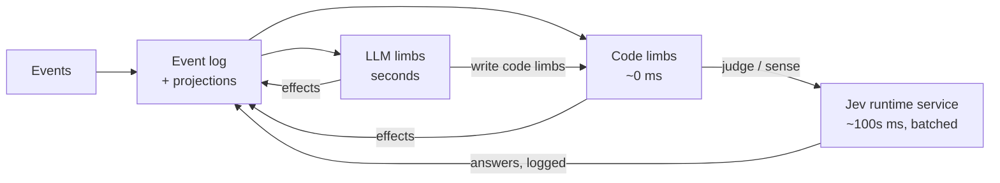

# Architecture

**LLM limbs write code limbs, and code limbs can call Jev to turn the fuzzy world into numbers.** LLMs generate, code executes in milliseconds, and Jev judges fuzzy things with calibrated probabilities. Jev is not a separate actor. It is a function the code calls, like reading the clock.



Every event is appended to the log and projected. Code limbs (watches as data, programs as sandboxed JS) react to events and levels, and call Jev when a condition needs meaning rather than numbers. LLM limbs are woken by code limbs and rewrite them.

| Limb kind | Latency | Written by | Does |
|---|---|---|---|
| Code limbs | ~0 ms, or hundreds of ms when waiting on Jev | LLM limbs, with defaults | Watches and programs over events and levels, e.g. `on key_down 5 → stop_output`, `when sense("is the user stuck?") > 0.7 for 4 s → wake head` |
| LLM limbs | seconds | — | Talking, reasoning, planning, and writing code limbs |

Both kinds share one [limb contract](topology.md): a projection to read, capabilities and a risk class for effects, a budget, and a supervising parent.

## Jev as a runtime primitive

Jev is a calibrated evaluation model. It answers up to 64 typed questions per call, over up to 300k characters of state, fast and cheaply enough to run every few hundred milliseconds. It cannot generate text. The runtime exposes it to code as two functions. The same functions can be backed by a small fast LLM instead; M3 measures both.

| Primitive | Returns | Use it for |
|---|---|---|
| `judge(question, options?)` | A probability (or a choice with probabilities), once, asynchronously | One-off decisions inside code: "is this answer correct?", "does this message still fit?" |
| `sense(question, options?)` | A level the runtime keeps up to date, e.g. `user.confused = 0.83` since t | Continuous perception that watches can threshold with durations |

The runtime handles what each piece of code would otherwise get wrong:

- **Batching.** All `judge` and `sense` questions due in the same tick go to Jev as one request (up to 64 questions).
- **Coalescing and re-asking.** `sense` questions are re-asked when relevant state changes, at most once per interval, with one call in flight. This is the existing reflex loop's job.
- **Stale answers.** Every answer carries the log position it was computed from, so code can tell when state has moved on.
- **Timeouts and defaults.** A call that doesn't answer in time resolves to its default, and the failure is logged and shown in `attention.health`.
- **Replay.** Every question and answer is appended to the log, so a replay uses the recorded answers and code limbs stay deterministic.
- **Cost.** Calls are charged to the budget of the code limb that asked, and through it to the LLM limb that wrote that code. Jev is billed per call through the AI Gateway, not on a subscription, so the runtime also enforces an entity-wide cap on Jev calls per minute and per session, and shows spend in the inspector.

Jev only returns numbers. It cannot act, wake or stop anything. Whatever the code does with the answer is governed by that code limb's capabilities. "Jev signals, never commands" is therefore true by construction, not by a rule.

## What Jev makes possible

### Sense: language becomes levels

Code can't read "is the user frustrated?", but it can read `user.frustrated = 0.83`. With `sense`, an LLM limb writes its own perception alongside its reactions. "Stop if I change the subject" becomes one code limb:

```
when sense("did the user change the subject?") > 0.75 → stop_output
```

This is also how interrupt contracts work. Each run declares the conditions that should stop its actions. Exact ones are plain conditions. Fuzzy ones use `sense`.

### Judge: one-off decisions

`judge` answers a question once, inside code. It is for perception, not reasoning: in M3 both Jev and qwen said a correct arithmetic answer ("34") was wrong. Checking whether an answer is *correct* belongs to a strong limb (gpt-6-sol); `judge` suits questions like "does the draft ask for something?" or "is this answer off-topic?". It is also the test oracle for our capabilities-not-scripts scenarios ("did the entity acknowledge the stop?"). Cascades in general, "does it still fit?" checks, and routing by difficulty are in [future.md](future.md#jev-beyond-senses).

### The built-in draft sense

When Jev is on, the runtime installs one watch of its own, owned by the head and not cancellable by it: `sense("Does the unsent draft already contain a question or request to the entity that is clear enough to answer or act on?") > 0.4`, when the user has not typed for 700 ms, `→ wake head`. The typing pause was added after E3's first run answered a half-typed question. This is what lets the entity act on a draft before it is sent (scenarios 7, 8). The question and threshold were tuned on Jev in M3: complete requests score about 0.4–0.85, while fragments, asides and "can you" score 0.18 or less.

## Code limbs: watches and programs

Every watch and program an LLM limb installs becomes a **code limb**: named, supervised by the limb that wrote it, visible in the inspector, and stoppable like any other limb. Its budget is an effect rate limit plus its Jev calls.

- **Watches are validated data.** A watch is a condition over [events and levels](core-model.md#levels-and-events), including levels from `sense`. A watch has one trigger plus optional `when` conditions: levels, senses, and quiet periods such as `{"quiet": "draft_changed", "for_ms": 700}` (the user stopped typing), combined with `all` / `any` / `not`. It triggers on an event edge (`key_down 5`) or on a level with a duration (`key 5 held > 2 s`, `user.confused > 0.7 for 3 s`). Its action is an effect, `stop_output`, a wake, or starting a program. Watches are small, and the LLM gets them right most often when they are data checked against a schema.
- **Programs are sandboxed JavaScript.** A program is an async function the LLM writes, run in a sandbox whose only capabilities are the effect API, `judge`, `sense`, `wait`, and read access to the limb's projection. Stateful behaviour is trivial in JS and painful as tree-shaped data: the Morse decoder in E1 must collect dots and dashes and detect letter and word gaps. "Count to 50, one message each" is a `for` loop with `await say(i)` and `await wait(333)`. Every effect goes through the same gate, so an output stop halts a program at its next effect or wait, and it can be cancelled or killed like any limb.
- **Risk is enforced at the effect boundary, not in the code.** A program can compute anything, but it can only act through effects, and each effect is checked against the program's capabilities, risk class and rate limit.

## Risk classes

Every effect declares a **risk class**:

- **`reflex`** effects can be fired freely by code limbs at full speed. The keypad is the demo's example.
- **`limb`** effects (such as `say`, `dispatch`, memory writes) can be fired by LLM limbs, and by code limbs within a tighter rate limit, with each firing shown to the authoring limb.
- **`confirm`** effects need the user's approval. There are none in the demo.

The host marks its own effects the same way, so a game decides which of its moves a reflex may make.

## The floor: never worse than a normal agent

With Jev and code limbs off, broken or silent, the entity must still behave at least as well as a normal chat agent. Everything fast is an addition on top of this floor.

- **Baseline wakes in code.** A sent user message always wakes the voice limb, after a short configurable debounce so bursts arrive together. Code limbs can add earlier wakes; they can never cancel this one.
- **The voice never queues behind itself.** If the voice limb is still busy when a new wake arrives (a user message, an output stop), a fresh reactive run starts in parallel instead of waiting. In the spike a single mind serialised wakes, and acknowledging a stop took 7–10 s because the stop's wake waited for the previous run to finish.
- **Heartbeat.** A `tick` event fires every second. It reaches code limbs, which may decide to wake an LLM limb. On its own, the heartbeat wakes the head only rarely (every few minutes while something is active, never while idle), so ticking costs almost nothing on Codex.
- **Health is visible.** Jev timeouts and errors and failed code limbs become events (`jev_unavailable`, `program_failed`) and show up in `attention.health`. A limb that sees its reflexes are down can do the work itself, for example pressing keys directly instead of relying on a mirror watch.
- **LLM limbs fail too.** Model timeouts, rate limits and outages are retried, then fall back to a configured backup model, and surface as `limb_failed`. Another limb, or the next wake, sees what went unfinished in `self.tasks`.
- **Limbs can do everything the fast tiers do**, only slower. Reflexes and programs are optimisations, never the only path to a behaviour.

## Guardrails

- **No echo loops.** Every event carries `by` (user, entity, host, limb id). Watches ignore the entity's own events unless they opt in, and reflex effects are rate-limited per watch, so a mirror watch can't chase its own key presses forever.
- **Everything the entity writes is validated.** Watch conditions and every tool call's arguments are checked against their schema. Programs are compiled in the sandbox before they start, and a syntax or runtime error ends the program with a `program_failed` event carrying the error. Anything invalid is rejected, nothing is applied, and the exact error goes back as the tool result so the model can correct itself. The M0.5 spike showed this is mandatory, not defensive: a model invented watch fields (`on: "key"`, `on: "hold"`) until errors came back, and then fixed them on its own. The number of active watches and programs is capped, each has an optional expiry, and all of them are visible in the inspector.

## User controls

The user controls work like a stopwatch. They belong to the user, never to the entity.

| Control | Effect |
|---|---|
| Start | Creates the session. Baseline wakes and the heartbeat begin. |
| Pause | All effects are blocked and nothing new wakes. Timers and the heartbeat freeze. In-flight model calls are aborted so spending stops. Nothing is cleared. |
| Resume | Timers continue, and the entity gets `resumed{paused_for}` so it knows time passed. Task limbs continue their session from the last complete message; reactive limbs wake again from state. |
| Reset | Aborts everything and starts a clean session. The old one is archived, not deleted. |

Each running period (Start or Resume until Pause) has one root `AbortController`. Every limb run, Jev call, timer and code limb gets a child signal, so Pause is a single abort that nothing can outlive. The only loss is a partially streamed response.
