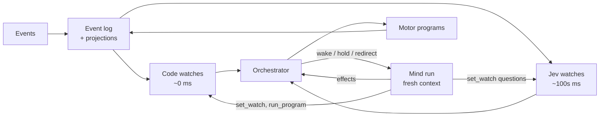

# Architecture

The LLM mind decides **what to pay attention to**. Code and Jev do the watching. Each mind run leaves behind an attention program that the fast tiers enforce until the next run replaces it.

Every event is appended to the log and projected, then passes through the watches. The watches tell the orchestrator whether to wake a limb, hold its effects, or redirect it.

| Tier | Latency | Authored by | Does |
|---|---|---|---|
| Code watches | ~0 ms | Mind, with defaults | Deterministic conditions over events and levels, e.g. `on key_down 5 → hold output`, `on user key_down k → key_down k`, `when typing for > 30 s → wake head` |
| Motor programs | ~0 ms | Mind | Behaviour trees: sequences, parallels, fallbacks, delays, repeat-until. No LLM in the loop. |
| Jev watches | hundreds of ms | Mind, with defaults | Fuzzy typed questions over state and new events, e.g. "Did the user change the subject?" or "Does this message change the current task?" |
| Mind | seconds | — | Talking, reasoning, planning, and rewriting the tiers above |

This tightens the Jev–LLM loop in three ways:

1. **Each run declares an interrupt contract.** Along with its actions, every run states the conditions that should stop its actions. Code enforces the exact ones, and Jev asks the fuzzy ones while the run is in flight, signalling its answers into the run.
2. **Jev routes events that arrive mid-run.** It picks one of three outcomes. **Ignore:** fold the event into state, and the next wake sees it. **Redirect:** blip `steer` the original event into the running thought. **Parallel:** wake a fresh limb to handle it while the busy one keeps working. Code watches override Jev where they match.
3. **Jev adds wakes.** Default Jev questions such as "Does anything here need a response?" can wake an idle entity earlier than the baseline would. Jev never suppresses the baseline wakes described under [the floor](#the-floor-never-worse-than-a-normal-agent).

The orchestrator owns the event log, the projections, the watches, the programs and the lifecycle of the limbs. The mind is not one model; see [topology.md](topology.md).

## Watches and motor programs

We don't invent a DSL. Both are data the mind writes as a tool call, validated before they are installed.

- **Watches** are conditions over [events and levels](core-model.md#levels-and-events), combined with `all` / `any` / `not`, extending reflex's existing condition shapes. A watch triggers on an event edge (`key_down 5`) or on a level with a duration (`key 5 held > 2 s`, `no user message for 10 s`), and its action is an effect, a hold, a wake, or starting a motor program.
- **Motor programs** are behaviour trees, the structure game AI uses for interruptible behaviour: `sequence`, `parallel`, `fallback`, `repeat_until`, `wait`, and leaves that are effects or conditions. They tick on the orchestrator's clock, can be cancelled at any node by a hold, and are easy to inspect. LLMs write them well. "Count to 50, one message each" is a `repeat_until` over `say` and `wait`, and "press 556" is a `sequence` of three `press` leaves.

## Jev's authority

Jev is small, fast and sometimes wrong, so it **signals rather than commands**. Its power is limited to things that are cheap to undo or harmless.

| Jev may | Jev may not |
|---|---|
| Emit signals with a confidence, e.g. `subject_changed p=0.8`, as events a limb reads | Kill or abort a limb's thought |
| Wake a limb, or deliver an existing event into a running limb | Write instructions, prompts or goals for a limb. It only delivers the original event. |
| Trigger **reflex-safe** effects directly, e.g. keypad presses | Trigger `say`, `spawn`, `set_watch`, memory writes, or any host effect not marked reflex-safe |
| Place a hold, only when a limb's watch explicitly delegates it; holds are reversible | Edit state outside its own `signals` section |

Every effect declares a **risk class**. `reflex` effects can be fired by Jev or code; the keypad is the demo's example. `limb` effects can only come from an LLM limb. `confirm` effects need the user's approval; there are none in the demo. The host marks its own effects the same way, so a game decides which of its moves a reflex may make. Code watches are deterministic and written by limbs, so they can do anything their authoring limb could.

## The floor: never worse than a normal agent

With Jev and motor programs off, broken or silent, the entity must still behave at least as well as a normal chat agent. Everything fast is an addition on top of this floor.

- **Baseline wakes in code.** A sent user message always wakes the voice limb, after a short configurable debounce so bursts arrive together. Jev and watches can add earlier wakes; they can never cancel this one.
- **Heartbeat.** A `tick` event wakes a limb periodically so the entity can notice things nothing else flagged. The interval adapts: seconds while tasks, holds or programs are active, backing off to minutes when idle. It is configurable and capped by cost.
- **Health is visible.** Jev timeouts, evaluator errors and failed motor programs become events (`jev_unavailable`, `program_failed`) and show up in `attention.health`. A limb that sees its reflexes are down can do the work itself, for example pressing keys directly instead of relying on a mirror watch.
- **LLM limbs fail too.** Model timeouts, rate limits and outages are retried, then fall back to a configured backup model, and surface as `limb_failed`. Another limb, or the next wake, sees what went unfinished in `self.tasks`.
- **Limbs can do everything the fast tiers do**, only slower. Reflexes and programs are optimisations, never the only path to a behaviour.

## Guardrails

- **No echo loops.** Every event carries `by` (user, entity, host, limb id). Watches ignore the entity's own events unless they opt in, and reflex effects are rate-limited per watch, so a mirror watch can't chase its own key presses forever.
- **Watches the entity writes are checked.** Watch conditions and behaviour trees are validated against their schema when installed. The number of active watches and programs is capped, each has an optional expiry, and all of them are visible in the inspector.

## User controls

The user controls work like a stopwatch. They belong to the user, never to the entity or Jev.

| Control | Effect |
|---|---|
| Start | Creates the session. Baseline wakes and the heartbeat begin. |
| Pause | All effects are held and nothing new wakes. Timers and the heartbeat freeze. In-flight model calls are aborted so spending stops. Nothing is cleared. |
| Resume | Timers continue, and the entity gets `resumed{paused_for}` so it knows time passed. Task limbs continue their session from the last complete message; reactive limbs wake again from state. |
| Reset | Aborts everything and starts a clean session. The old one is archived, not deleted. |

Each running period (Start or Resume until Pause) has one root `AbortController`. Every limb run, Jev call, timer and program gets a child signal, so Pause is a single abort that nothing can outlive. The only loss is a partially streamed response.
