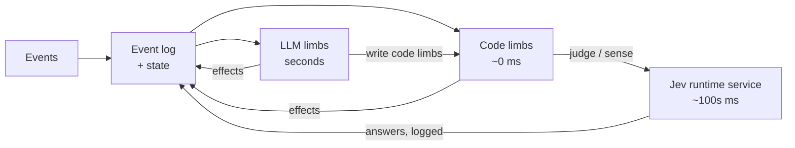

# Architecture

**LLM limbs write code limbs, and code limbs can call Jev to turn the fuzzy world into numbers.** LLMs generate, code executes in milliseconds, and Jev judges fuzzy things with calibrated probabilities. Jev is not a separate actor. It is a function the code calls, like reading the clock.



Every event is appended to the log. Code limbs (watches as data, programs as sandboxed JS) react to events and levels, and call Jev when a condition needs meaning rather than numbers. LLM limbs are woken by events and code limbs, and write and rewrite code limbs.

| Limb kind | Latency | Written by | Does |
|---|---|---|---|
| Code limbs | ~0 ms, or hundreds of ms when waiting on Jev | LLM limbs, plus the runtime's built-in draft watch | Watches and programs over events and levels, e.g. `on key_down 5 → stop_output`, `when sense("is the user stuck?") > 0.7 for 4 s → wake` |
| LLM limbs | seconds | — | Talking, routing, reasoning, reviewing, and writing code limbs |

Which LLM limbs exist and what each may do is in [topology.md](topology.md).

## Jev as a runtime primitive

Jev is a calibrated evaluation model. It answers typed questions over state, fast and cheaply enough to run every few hundred milliseconds. It cannot generate text. The runtime exposes it to code as two functions. The same functions can be backed by a small fast LLM instead; M3 compared both and chose Jev ([plan.md](plan.md#results)).

| Primitive | Returns | Use it for |
|---|---|---|
| `judge(question)` | A probability, once, asynchronously | One-off perception inside code: "does the draft ask for something?" |
| `sense(question)` | A level the runtime keeps up to date, e.g. `sense.user_confused = 0.83` since t | Continuous perception that watches can threshold with durations |

The runtime's `JevService` handles what each piece of code would otherwise get wrong:

- **Coalescing and re-asking.** `sense` questions are re-asked when relevant state changes, at most once per interval, with one call in flight per question. Judges asked in the same moment go out together.
- **Timeouts and defaults.** A call that doesn't answer in time resolves to its default, and the failure shows up in health.
- **Logging.** Every question and answer is appended to the log (`judged`, `sensed`).
- **Cost.** Jev is billed per call through the AI Gateway, not on a subscription, so the runtime enforces entity-wide caps (60 calls a minute, 2000 a session) and the bench shows the count.

Jev only returns numbers. It cannot act, wake or stop anything. Whatever the code does with the answer is governed by what that code limb's author may do, so "Jev signals, never commands" is true by construction.

Not built yet: replaying recorded Jev answers so a replayed session is deterministic, and charging Jev calls to the limb that asked.

## What Jev makes possible

### Sense: language becomes levels

Code can't read "is the user frustrated?", but it can read `sense.user_frustrated = 0.83`. With `sense`, an LLM limb writes its own perception alongside its reactions. "Stop if I change the subject" becomes one code limb:

```
when sense("did the user change the subject?") > 0.75 → stop_output
```

This is also how interrupt contracts work. Each run declares the conditions that should stop its actions. Exact ones are plain conditions. Fuzzy ones use `sense`.

### Judge: one-off perception

`judge` answers a question once, inside code. It is for perception, not reasoning: in M3 both Jev and qwen said a correct arithmetic answer ("34") was wrong. Checking whether an answer is *correct* belongs to a strong model, which is what answer review does ([parallel-conversation.md](parallel-conversation.md#second-looks)). `judge` suits questions like "does the draft ask for something?" or "is this answer off-topic?". It is also the test oracle for scenario tests ("did the entity acknowledge the stop?"). Cascades and difficulty routing with Jev are in [future.md](future.md#jev-beyond-senses).

### The built-in draft sense

When Jev is on and `draftAttention` is set, the runtime installs one watch of its own, owned by the front limb and not cancellable by it: `sense("Does the unsent draft already contain a question or request to the entity that is clear enough to answer or act on?") > 0.4`, when the user has not typed for 700 ms, `→ wake`. The typing pause was added after E3's first run answered a half-typed question. This is what lets the entity act on a draft before it is sent. The question and threshold were tuned on Jev in M3: complete requests score about 0.4–0.85, fragments, asides and "can you" 0.18 or less. The Hub bench has Jev off by default.

## Code limbs: watches and programs

Every watch and program an LLM limb installs becomes a **code limb**: named, with a short `label`, supervised by the limb that wrote it, visible in the inspector and on the Work canvas, and stoppable like any other limb. It ends when its author (a worker) finishes.

- **Watches are validated data.** A watch has one trigger (an event edge like `key_down 5`, a level with a duration like `key.5.held` for 2 s, or a `sense` threshold) plus optional `when` conditions: levels, senses, and quiet periods such as `{"quiet": "draft_changed", "for_ms": 700}`, combined with `all` / `any` / `not`. Triggers count only the user's events unless `by` says otherwise. Its action is an effect (args can copy fields of the triggering event with `$key`), `stop_output`, `resume_output`, a wake, or starting a program. A watch can fire `once` or expire after `expires_s`. Watches get this right most often because they are data checked against a schema.
- **Programs are sandboxed JavaScript.** A program is the body of an async function, run in QuickJS (32 MB, 250 ms between awaits). Its API: the channel effects (`say`, `press`, `key_down`, `effect(name, args)` and so on), `wait`, `nextEvent`, `judge`, `sense`, `state()`, `now()`, `console.log`, and `wake(reason)`, which hands something that needs thinking (like composing a reply) to its author, at most once a second. Stateful behaviour is trivial in JS: the Morse decoder in E1 collects dots and dashes and detects letter and word gaps. A program that finishes or fails wakes its author.
- **Risk is enforced at the effect boundary, not in the code.** A program can compute anything, but it can only act through effects, and every effect goes through the gate: the author's role, output stops, rate limits (programs are slowed to their limit, watches drop what's over it), and path claims.

## Risk classes

Every effect declares a **risk class**:

- **`reflex`** effects can be fired freely by code limbs at full speed (30 a second). The keypad is the demo's example.
- **`limb`** effects (such as `say` and workspace writes) can be fired by LLM limbs, and by code limbs within a tighter rate limit (5 a second).
- **`confirm`** effects need the user's approval. There are none yet, and the gate rejects them.

The host marks its own effects the same way, so a game decides which of its moves a reflex may make.

## The floor: never worse than a normal agent

With Jev and code limbs off, broken or silent, the entity must still behave at least as well as a normal chat agent. Everything fast is an addition on top of this floor.

- **Baseline wakes in code.** A sent user message always wakes the front limb, after a 150 ms debounce, held while the user keeps typing (at most 6 s), so a burst of messages is handled together. Code limbs can add earlier wakes; they can never cancel this one.
- **Reactive limbs never queue behind themselves.** If the head, voice or reviewer is busy when a new wake arrives, a fresh run starts in parallel; the newest run owns the limb's actions ([topology.md](topology.md#rules)). In the spike a single mind serialised wakes, and acknowledging a stop took 7–10 s. Workers are different: a busy worker gets updates with its next tool result instead of a second run.
- **Workers don't stop short.** A worker that runs out of turns while still working is continued in the same conversation, up to 4 times, then marked failed with what it had.
- **Heartbeat.** An internal 50 ms tick rechecks level watches. The head gets a heartbeat wake every 3 minutes while workers are running, queued or waiting, never otherwise: its own standing watches and programs (a mirror, the draft sense) don't count, so ticking costs almost nothing.
- **Health is visible.** Jev timeouts and failed code limbs become events and show up in health. A limb that sees its reflexes are down can do the work itself.
- **LLM limbs fail too.** A crashed worker run is retried up to 3 times in a minute, then the worker is marked failed. Every crash is logged as `limb_failed`. The head is not retried; the next event wakes it again. A backup model is not built yet.
- **Answers get a second look.** With review on, a stronger model reviews every answer of the front limb and corrects it in the open ([parallel-conversation.md](parallel-conversation.md#second-looks)).
- **Limbs can do everything the fast tiers do**, only slower. Reflexes and programs are optimisations, never the only path to a behaviour.

## Guardrails

- **No echo loops.** Every event carries `by`. Watches ignore the entity's own events unless they opt in, and code limb effects are rate-limited, so a mirror watch can't chase its own key presses forever.
- **What the entity writes is validated.** Watch specs, programs, channel effect arguments, and the arguments of `run_program`, `dispatch`, `dispatch_many`, `fork` and `amend` are checked against their schema. Programs are compiled in the sandbox, and a syntax or runtime error ends the program with `program_failed`, whose error goes back to its author. Anything invalid is rejected, nothing is applied, and the exact error goes back as the tool result so the model can correct itself. The M0.5 spike showed this is mandatory: a model invented watch fields until errors came back, then fixed them on its own. The simpler tools (`stop_output`, `note`, `steer`, `claim` and so on) read their arguments leniently.
- **Limits.** At most 32 watches and programs, 6 running workers (the rest queue), 500 queued workers.

## User controls

The user controls work like a stopwatch. They belong to the user, never to the entity.

| Control | Effect |
|---|---|
| Start | Creates the session. Baseline wakes and the heartbeat begin. |
| Pause | Effects are blocked and nothing new wakes. In-flight model calls are aborted so spending stops; programs block at their next effect. Nothing is cleared. |
| Resume | The entity gets `session_resumed{paused_for_ms}` so it knows time passed. Workers continue their conversation; reactive limbs wake again from state. |
| Reset | Aborts everything and starts a clean session. The old log is kept in its recording. |

The user can also message or stop one worker, and reroute a message, from the Work canvas ([work-canvas.md](work-canvas.md)).

Not built yet: one root abort signal per running period that every run, Jev call, timer and program shares, so Pause is a single abort that nothing outlives. Today Pause aborts the model runs; in-flight Jev calls finish, and `nextEvent` timeouts keep counting.
