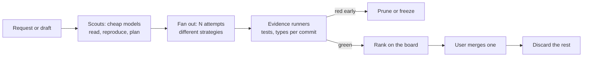

# Coding: engineering as a search

The entity doesn't try to be a smarter coder than Codex or Claude Code. It runs engineering as a **search**: several cheap attempts in parallel, pruned early by real evidence, steered live by the user, with nothing merged until the user says so. Real-time parts make this affordable: code limbs and Jev do the watching, LLMs are woken only when something meaningful happens, and the voice stays with the user throughout.

## When it beats a single agent, and when it doesn't

| Better than a single agent | Not better |
|---|---|
| The task is uncertain enough that several attempts beat one | Small, clear tasks: then the entity delegates to one agent and stays out of the way |
| Tests, types or a repro give a real signal | No signal: the entity must first write the failing test, or fall back to one attempt plus review |
| The user wants to keep working or talking meanwhile | The user wants to watch one agent's every step |

Evidence is the limiting factor. In M3 neither Jev nor qwen could tell a correct arithmetic answer from a wrong one, so **pruning and ranking rest on tests, typechecks and repros**. LLM review is a secondary signal, never the gate.

## Code as drafts

The user's unsent message is a draft the entity can already act on. Branches work the same way. Every attempt lives in its own worktree (a drone) as a **candidate**. The entity keeps a **board** of candidates, each with its evidence. Only the user merges.

| Candidate field | Meaning |
|---|---|
| Goal | What this attempt is trying, and its strategy ("minimal patch", "refactor the parser", ...) |
| Model and cost | Which backend, tokens and money so far |
| Evidence | Scoped tests, typecheck, lint, repro script: pass / fail / running, with timestamps |
| Diff | Size, files touched, whether it touches areas the user marked off-limits |
| Review | Notes from a reviewer limb; a secondary signal only |
| Integration | Whether it merges cleanly with the other promising candidates and with `main` |
| Status | scouting, promising, frozen, pruned, ready, merged, discarded |

## Loop

1. **Scout.** Cheap limbs (gpt-6-luna) read the relevant code, reproduce the problem, and write a failing test if none exists. Scouts can start from the **draft**, before the user sends the request.
2. **Fan out.** The head chooses how many attempts to launch and with what strategies and models, within the budget. Strong models (gpt-6-sol) go where the scouts found the problem hard.
3. **Collect evidence continuously.** Code limbs run the scoped tests and typecheck on every commit in every branch. A hidden **integration branch** test-merges promising candidates, so conflicts show up early. Nothing touches `main`.
4. **Prune early.** Rules the head installs as watches, e.g. "red on the repro after 3 commits → freeze", "no new commit for 5 min → sense: is it going in circles?", "over its budget share → freeze". Pruned work stays in its worktree and can be resumed.
5. **Rank.** Green candidates are ranked by evidence first, then diff size, then review notes, then cost.
6. **Hand over.** The voice tells the user what is ready, with the trade-offs. The user merges, or asks for changes. Losing candidates are discarded when the user merges, or kept on request.

## Steering while it runs

- **Targeted steering.** A new constraint ("don't change the public API", "no new dependencies") becomes a sense per candidate. Only the affected candidates are redirected or frozen; the rest keep going.
- **Stay present.** The voice answers "how's it going?" from the board in about a second. "Pause everything" freezes every candidate with nothing lost.
- **User edits are events.** While the user edits a file, candidates touching that file are asked to avoid it or are frozen, so the entity never overwrites the user's work.

## Spend policy

- **The budget is set by the user**, in money or time, or as "subscription models only". It is shown live, per candidate and in total.
- **Spending is staged.** Cheap scouts first, then strong models only where there is evidence. More parallelism is faster but costs more, and the entity says which trade-off it is making.
- **Idle work is drafts only.** When the user is away, the entity may do cheap, useful chores within a small idle budget: triage flaky tests, follow up on review comments, pre-read the next item on the user's list. It produces candidates, never merges.
- **Caps are hard.** At the cap, candidates freeze, and the voice asks.

## Repository reflexes

The entity keeps what it learns about the repository and the user as notes and saved watches:

- test scopes ("for `hub/entity` run these 3 files; the full suite takes 9 minutes")
- flaky tests to ignore or retry
- preferences ("no new dependencies", "small PRs")

Each run gets cheaper and faster. This builds on the memory design in [future.md](future.md#memory).

## What has to be built

| Piece | What | Notes |
|---|---|---|
| Coding-agent limbs | A limb whose backend is a real coding agent in its own worktree: a drone chat, or a blip session with workspace tools | The one structural change: a pluggable limb backend with its own tools, still under the same budget, supervision and stop rules |
| Workspace channel | Events: commit, test and typecheck results, diff stats, conflict checks, user file edits. Effects: create attempt, run evidence, freeze, steer, discard, promote to PR | `confirm` risk class for promote, push and destructive commands |
| Evidence runners | Code limbs that run scoped commands per branch, plus the hidden integration branch | Evidence is structured events, so watches can prune on it |
| Approval flow | Approve / deny for `confirm` effects in the bench | Today `confirm` effects are rejected |
| Budget accounting | Tokens and money per limb, candidate and session; caps; staged policy | Extends the Jev caps to every model |
| Counting conditions | Watch conditions like "5 failures in 60 s" or "no commit for 5 min" | Extends `when` |
| Persistence | Event log on disk; sessions resume after a Hub restart | A search can run for an hour |
| Candidate board | Branches, status, evidence, cost, diff preview, merge and discard | A new bench tab |

## First demo: race to fix a failing test

1. The user describes a bug. While they type, a scout starts reproducing it.
2. The entity launches 4 attempts on 2 models with different strategies.
3. Two go red early and are frozen. The user keeps chatting throughout.
4. The user says "no new dependencies". The one branch that added one is steered.
5. After about 10 minutes the board shows two green candidates with diffs and costs. The user merges one; the others are discarded.
