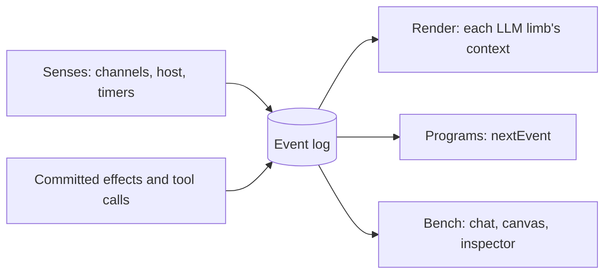

# Core model

The **event log** is the only source of truth. Everything that happens is appended to it as an **event**. What the entity knows at any moment is **state**: a projection built from the log. What the entity does is **effects**, and every committed effect is itself logged.

The runtime's own state (limbs and their status, claims, output stops, batches, notes, the review queue) is `reduceRuntime` over the log (`runtime-state.ts`): every change is an event first, so `replayRuntime(events)` rebuilds it exactly, and every core test checks that it does. Only what a log cannot hold stays outside it: abort controllers, timers, program sandboxes and rate limits. Levels come from the log too: channels derive theirs from events, and sensed levels are set from `sensed` events and cleared by `senses_dropped`.

The log is append-only and never rewritten. Reset starts a new log. Every event carries a sequence number, the entity clock `t` (ms since the session started), the wall clock `at`, a type, and `by`: `user`, `host`, `system`, or a limb id.

## State and what a limb sees

Channels (see [host-api.md](host-api.md)) reduce events into their own state: `chat` (recent messages, the user's unsent draft, the entity's own draft), `keypad` (held keys, recent presses) and `workspace`. The core keeps levels, notes, output stops, health, claims, discoveries and the limbs.

Every LLM limb gets a render in this order:

1. **Stable**: who it is (`you`), a worker's own `task`, each channel's stable part, notes (the last 20 `note`s), shared discoveries, the other limbs that are running or started in the last minute (one line each: id, role, name, status, parent, and a watch's condition), and the workers, one line each. Nothing here carries an age or a counter, so it only changes when something actually happens.
2. **Live**: each channel's volatile part (for chat: recent messages, by default the last 12, the unsent draft, the entity's own draft), which limbs have a run in flight, watch fire counts, levels with how long they have held, active output stops, and recent health warnings.
3. **New events** since this limb last read, at most the last 40, without internal noise. Long text in them is clipped to 300 characters, except what the user wrote and handoff notes; a new worker's task is left out, since the workers line shows it. A new worker's events start when it was spawned.
4. **Time**: `now_s`, when the entity last spoke, and why this run was woken.

Views differ by role. The front limb and the head see every active worker with its task (a batch worker shows its batch title instead), and the 10 most recently finished plus any whose conversation is kept, with their result. A worker sees up to 30 active siblings without their tasks and the last 5 finished. A worker keeps its conversation, so after its first wake its render shows only the stable and live parts that changed. Older history stays in the log; `read_chat(before_seq, limit)` pages back through chat.

Programs read the log with `nextEvent(matcher, timeoutMs)` through their own cursor: events come in order from where the program started, and nothing that happens between two calls is missed. Events are strict: reading a field an event doesn't have fails the program with the fields it does have. Keypad events carry derived timing (`held_ms` on `key_up`, `gap_ms` on `key_down`), so a Morse decoder needs no timing arithmetic of its own.

## Levels and events

Borrowed from functional reactive programming, the world has two kinds of facts:

| Kind | Meaning | Examples |
|---|---|---|
| **Event** | Something that happens at an instant | `chat_message`, `draft_changed`, `key_down`, `key_up`, `timer`, `output_stopped`, `limb_spawned`, `steered`, `task_done`, `limb_failed`, `program_failed`, `review_queued`, `message_reviewed` |
| **Level** | A value that holds over time, with a known start | `user.typing` (since the draft started), `key.5.held`, and sensed levels such as `sense.user_confused = 0.83` |

Levels are derived from events by the channels (a key is held from its `key_down` to its `key_up`), so they cost nothing extra. **Sensed levels** are the exception: the runtime keeps them up to date by asking Jev (see [architecture.md](architecture.md#sense-language-becomes-levels)). Levels give time directly to watches and renders: "5 held for over 2 s" and "typing for 30 s" are plain conditions, not timer bookkeeping.

Besides channel events, the runtime logs its own: tool calls (`tool_called`, `tool_done`), runs (`run_started`, `run_finished` with usage), workers (`limb_spawned`, `limb_started`, `limb_queued`, `limb_revived`, `task_continued`, `cancel_requested`, `task_done`, `work_summary`), routing (`steered`, `rerouted`, `group_started`, `group_finished`), coordination (`claimed`, `released`, `discovery`, `handoff`), code limbs (`watch_installed`, `watch_fired`, `watch_woke`, `program_started`, `program_woke`, `program_finished`), review (`review_queued`, `review_started`, `review_requeued`, `message_reviewed`), health warnings (`health`), chat updates (`chat_message_updated`), and the session (`session_started`, `session_paused`, `session_resumed`).

## Effects and tools

Channel effects go through one gate: schema validation, the limb's role (the reviewer only reads), output stops, dependencies, rate limits for code limbs, and path claims. They are the only things programs and watches can do.

- Chat: `say` (with `reply_to`, and `thread` to post only in a worker's own thread), `set_draft`, `read_chat`.
- Keypad: `press`, `key_down`, `key_up`.
- Workspace: `list_files`, `read_file`, `search`, `write_file`, `edit_file`, and `run` when commands are allowed.

The runtime's own tools are handled directly and are only for LLM limbs: `set_watch`, `run_program`, `stop_output`, `resume_output`, `note`, `set_timer`, `cancel` (with `now` to stop at once); for the front limb and head `dispatch`, `dispatch_many`, `fork`, `steer`; for the voice and reviewer `handoff`; for the reviewer `amend`; for workers `claim`, `release`, `share`, `finish_task`. Which limb gets which is one table per role ([topology.md](topology.md#the-limbs)). Output stops and dependency checks don't apply to them.

Effects apply as soon as their tool call streams in, with one exception: the front limb's actions wait until the user has stopped typing (at most 6 s), and are superseded if a new user message arrived after the limb read the state. See [topology.md](topology.md#rules).

**An effect can declare what it depends on** (`dependsOn`). At commit time only those dependencies are checked against the log since the limb read it; if one changed, the effect is rejected with the reason. The log advancing with unrelated keystrokes is never a conflict. The mechanism is built and tested, but no shipped channel effect declares a dependency yet: the front limb's supersede rule covers the common case of a newer user message.

## Time is a sense

Every render ends with a time block in the volatile tail, so it doesn't break caching: `now_s`, how long since the entity last spoke, and why the run was woken. Each recent event and chat message carries its age ("4.0s ago"), and each level how long it has held.

Limbs schedule their own future with `set_timer(after_ms, label)`, at most an hour ahead, which comes back as a `timer` event. The head's heartbeat (every 3 minutes while workers are running, queued or waiting) means time keeps passing for the entity even when nothing happens.

## Interrupts stop output, not thoughts

A watch such as "stop when I press 5" runs **`stop_output`**. A stop has a scope and a mode.

| Scope | Covers |
|---|---|
| `work` (default) | Everything under the limb that owns the stop (its programs, watches and workers), but not that limb itself, so the voice can still talk |
| `subtree` | The same, plus the owner |
| `entity` | All entity output |

| Mode | Effect |
|---|---|
| `stop` (default) | Programs in scope are cancelled at once; other actions get a tool result like `output stopped: user pressed 5` |
| `freeze` | Programs and workers wait at their next action and continue after `resume_output` (for at most 10 minutes), with nothing lost; watches, the voice, the head and the reviewer are rejected instead |

A stop halts the work in flight when it was issued. Work an LLM deliberately starts afterwards (a program, a watch, a worker) is not covered, and a program launched later by a watch counts from when that watch was decided. Workspace writes and commands are not output, so stops don't block them.

"Stop counting when I press 5" is a `stop`. "Freeze while I hold 9, continue when I release it" is a `freeze` plus a `resume_output` watch. A limb whose output was stopped keeps thinking, sees the stop in its tool results, and decides what to do. The owner is woken so it can react, unless it stopped its own output and already knows.

We deliberately don't call this a "hold". In the M0.5 spike a model read a `hold` action as "hold key 6", because holding keys is also part of the world.

Thoughts are only stopped from outside by lifecycle: a parent (or the front limb, for any worker) can cancel, gracefully or at once ([topology.md](topology.md)), the user can stop a worker from the Work view or Pause and Reset the session, and a worker's watches and programs end when it finishes. A watch's `stop_output` in `stop` mode cancels programs; it never stops an LLM run.
