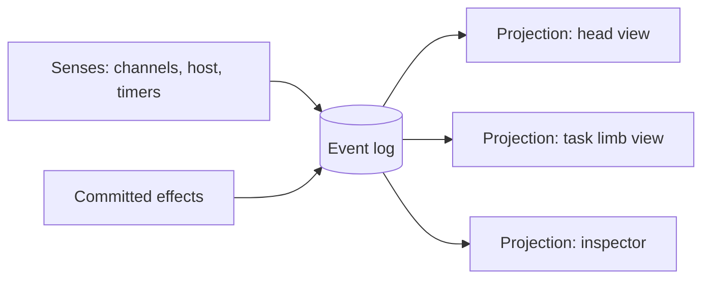

# Core model

The **event log** is the only source of truth. Everything that happens is appended to it as an **event**. What the entity knows at any moment is **state**: a projection built from the log. What the entity does is **effects**, and every committed effect is itself logged.

The log is append-only and never rewritten. Projections are cheap to rebuild, so replay, time travel, test stories and Reset (a new log) come almost for free, and "nothing is ever deleted" is true by construction.

## State: projections of the log

State is bounded JSON built by reducers from the log. Each section has a configurable token budget that the entity can see. The **core** owns a few sections, and **channels** (see [host-api.md](host-api.md)) add their own.

- `self` (core): goals, tasks, and a scratchpad, written only by the entity.
- `attention` (core): active output stops, the active `sense` questions, and `health`.
- `limbs` (core): a one-line status per limb of both kinds (LLM and code), e.g. "task limb: counting, 12 s, last said '11'" or "code limb 'mirror keys': 14 fires". This is how the entity feels its own arms: limbs see each other's status and committed results, not each other's context.
- `world.*` (channels and host): any schema the host wants. The demo's channels add `world.chat` (recent messages, by default the last N), `world.draft` (the user's unsent input), `world.keys` (which keys are held and by whom), and later `world.speech`. Chat and draft go into every context.

Each limb reads its own **projection** of the log (its `view`, see [topology.md](topology.md)). A keypad limb can see keys and recent chat only, while the head sees everything. Projections are views over the same log, so they never disagree about facts, only about what is included.

Programs read the log with `nextEvent(matcher, timeoutMs)` through their own cursor: events come in order from where the program started, and nothing that happens between two calls is missed. Keypad events carry derived timing (`held_ms` on `key_up`, `gap_ms` on `key_down`), so programs such as a Morse decoder need no timing arithmetic of their own.

Older history is not in state but always in the log. Limbs read it with tools such as `read_chat(since, limit)` and `search_chat`, with pagination. Only history older than the projection's window needs a tool call.

## Levels and events

Borrowed from functional reactive programming, the world has two kinds of facts:

| Kind | Meaning | Examples |
|---|---|---|
| **Event** | Something that happens at an instant | `key_down{key, by}`, `key_up{key, by}`, `chat_message{from}`, `draft_changed`, `timer`, `tick`, `output_stopped{by watch}`, `task_done`, `limb_failed`, `program_failed` |
| **Level** | A value that holds over time, with a known start | key 5 is held (since t), the user is typing (since t), speech overlap is on (since t), the entity is thinking (since t), and sensed levels such as `user.confused = 0.83` (since t) |

Levels are derived from events by the core (key 5 is held from its `key_down` to its `key_up`), so they cost nothing extra. **Sensed levels** are the exception: the runtime keeps them up to date by asking Jev, turning language into numbers (see [architecture.md](architecture.md#sense-language-becomes-levels)). Once written, code treats them like any other level. Levels matter because they give time directly to watches and renders: "5 held for over 2 s", "typing for 30 s", "no reply for 10 s" are plain conditions, not timer bookkeeping.

Every event is timestamped, typed, and attributed with `by`. Bursts of `draft_changed` from keystrokes are coalesced.

## Effects

Effects are tool calls from the core and from channels.

- Core effects: `set_watch`, `run_program`, `stop_output`, `resume_output`, `note`, `dispatch`, `ask`, `cancel`, `kill`, `set_timer`, `remember`, `recall`.
- Demo channel effects: `say`, `set_draft` (the entity's own visible "typing" text), `press`, `key_down` / `key_up`.

Effects apply as soon as their tool call streams in, and every committed effect is appended to the log like any event.

**Each effect declares what it depends on.** A `press` depends on nothing. A `say` answering a message may depend on "no newer user message". A game move may depend on "the board hasn't changed". At commit time, only those dependencies are checked against the log since the limb read it. If one changed, the effect is rejected with the reason as its tool result. The log advancing with unrelated keystrokes, drafts or ticks is never a conflict. This is the same stale-decision check reflex already does.

## Time is a sense

Every render ends with a time block in the volatile tail, so it doesn't break caching.

- `now` and how long the session has been running
- the age of each recent event and chat message ("4s ago")
- how long each active level has held: the draft being typed, each held key, speech overlap
- how long this run has been thinking
- how long since the entity last spoke

Limbs can schedule their own future through `sleep_until(t)` and `set_timer(after, label)`, which come back as `timer` events. The heartbeat means time keeps passing for the entity even when nothing happens.

## Interrupts stop output, not thoughts

A watch such as "stop when I press 5" runs **`stop_output`**. A stop has a scope and a mode.

| Scope | Covers |
|---|---|
| `work` (default) | Everything under the limb that owns the stop (its programs, watches and task limbs), but not that limb itself, so the voice can still talk |
| `subtree` | The same, plus the owner |
| `entity` | All entity output |

| Mode | Effect |
|---|---|
| `stop` (default) | Programs in scope are cancelled; other actions get a tool result like `output stopped: user pressed 5` |
| `freeze` | Programs and task limbs pause at their next action and continue after `resume_output`, with nothing lost; watches and the voice are rejected instead |

"Stop counting when I press 5" is a `stop`. "Freeze while I hold 9, continue when I release it" is a `freeze` plus a `resume_output` watch. A limb whose output was stopped keeps thinking, sees the stop in its tool results, and decides what to do: acknowledge it, finish the thought quietly, or park it in `self`.

The owner is woken so it can react, unless it stopped its own output and already knows.

We deliberately don't call this a "hold". In the M0.5 spike a model read a `hold` action as "hold key 6", because holding keys is also part of the world.

Killing a thought outright is something the entity can choose to do. Only a parent limb (cancel or kill, see [topology.md](topology.md)) or the user (Pause, Reset) stops a limb from outside. Watches and Jev never do.
