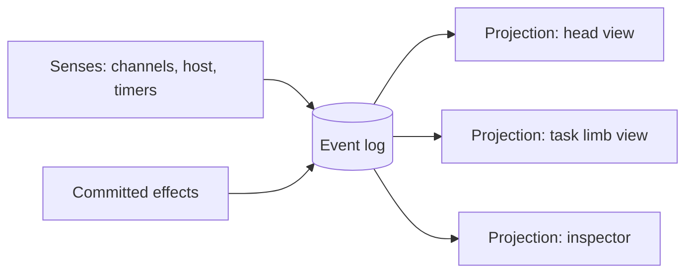

# Core model

The **event log** is the only source of truth. Everything that happens is appended to it as an **event**. What the entity knows at any moment is **state**: a projection built from the log. What the entity does is **effects**, and every committed effect is itself logged.

The log is append-only and never rewritten. Projections are cheap to rebuild, so replay, time travel, test stories and Reset (a new log) come almost for free, and "nothing is ever deleted" is true by construction.

## State: projections of the log

State is bounded JSON built by reducers from the log. Each section has a configurable token budget that the entity can see. The **core** owns a few sections, and **channels** (see [host-api.md](host-api.md)) add their own.

- `self` (core): goals, tasks, and a scratchpad, written only by the entity.
- `attention` (core): active watches, holds, motor programs and `health`.
- `limbs` (core): a one-line status per limb, e.g. "task limb: counting, 12 s, last said '11'". This is how the entity feels its own arms: limbs see each other's status and committed results, not each other's context.
- `world.*` (channels and host): any schema the host wants. The demo's channels add `world.chat` (recent messages, by default the last N), `world.draft` (the user's unsent input), `world.keys` (which keys are held and by whom), and later `world.speech`. Chat and draft go into every context.

Each limb reads its own **projection** of the log (its `view`, see [topology.md](topology.md)). A keypad limb can see keys and recent chat only, while the head sees everything. Projections are views over the same log, so they never disagree about facts, only about what is included.

Older history is not in state but always in the log. Limbs read it with tools such as `read_chat(since, limit)` and `search_chat`, with pagination. Only history older than the projection's window needs a tool call.

## Levels and events

Borrowed from functional reactive programming, the world has two kinds of facts:

| Kind | Meaning | Examples |
|---|---|---|
| **Event** | Something that happens at an instant | `key_down{key, by}`, `key_up{key, by}`, `chat_message{from}`, `draft_changed`, `timer`, `tick`, `effect_held{by watch}`, `task_done`, `limb_failed` |
| **Level** | A value that holds over time, with a known start | key 5 is held (since t), the user is typing (since t), speech overlap is on (since t), the entity is thinking (since t) |

Levels are derived from events by the core (key 5 is held from its `key_down` to its `key_up`), so they cost nothing extra. They matter because they give time directly to watches and renders: "5 held for over 2 s", "typing for 30 s", "no reply for 10 s" are plain conditions, not timer bookkeeping.

Every event is timestamped, typed, and attributed with `by`. Bursts of `draft_changed` from keystrokes are coalesced.

## Effects

Effects are tool calls from the core and from channels.

- Core effects: `run_program`, `set_watch`, `note`, `spawn`, `recall`, `set_timer`.
- Demo channel effects: `say`, `set_draft` (the entity's own visible "typing" text), `press`, `key_down` / `key_up`.

Each effect commits against the log position its projection was built from, is checked again at commit time, and applies as soon as its tool call streams in. A committed effect is appended to the log like any event.

## Time is a sense

Every render ends with a time block in the volatile tail, so it doesn't break caching.

- `now` and how long the session has been running
- the age of each recent event and chat message ("4s ago")
- how long each active level has held: the draft being typed, each held key, speech overlap
- how long this run has been thinking
- how long since the entity last spoke

Limbs can schedule their own future through `sleep_until(t)` and `set_timer(after, label)`, which come back as `timer` events. The heartbeat means time keeps passing for the entity even when nothing happens.

## Interrupts hold actions, not thoughts

A watch such as "stop when I press 5" places a **hold** on effects: it cancels running motor programs, and further `say` or `press` calls get a tool result like `held: user pressed 5`. The limb keeps thinking, sees the hold inside its own run, and decides what to do: acknowledge it, finish the thought quietly, or park it in `self`.

Killing a thought outright is something the entity can choose to do. Only a parent limb (cancel or kill, see [topology.md](topology.md)) or the user (Pause, Reset) stops a limb from outside. Watches and Jev never do.
